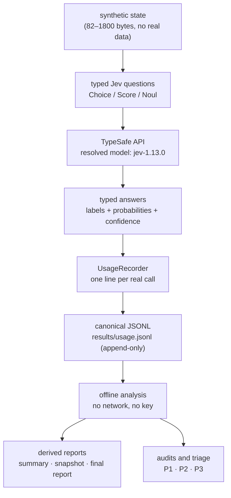
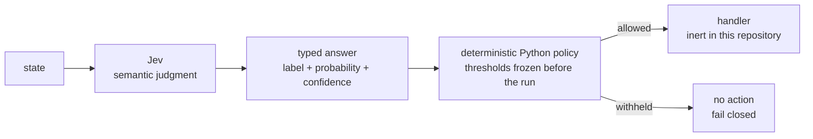
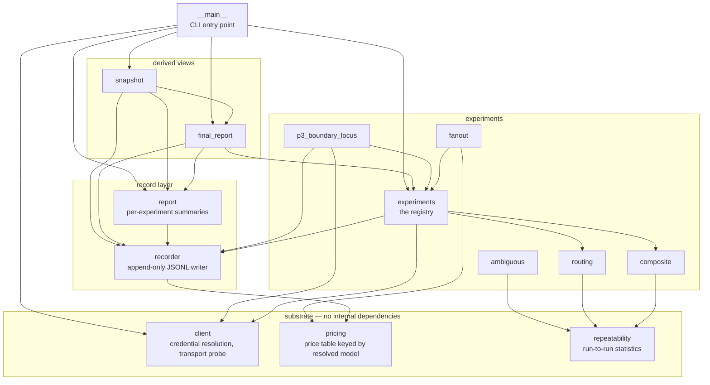

# Architecture

**English** | [简体中文](architecture.zh-CN.md)

This repository is a **CLI and an evidence store**, not a library and not a service. That shapes
everything below: the supported interface is the command line plus the files it writes, and the
Python package exists to serve those two things.

---

## 1. Data flow



The load-bearing property is the arrow from **API** to **JSONL**: one real API call produces
exactly one record, written by `UsageRecorder`, whether the call succeeded or raised. Nothing
bypasses the recorder, and nothing rewrites the log afterwards — it is append-only, so the file is
a chronological account of what was actually sent and actually returned.

Everything downstream of the log is **derived**. `report`, `snapshot` and `final-report` recompute
every number from the log on the way out, which is why they cannot drift from the records they
describe. A derived file that does not match the log is a stale copy, not a second measurement.

### Cost of a derivation, in one line

```
local estimate  =  input_tokens × published rate        (resolved model, one price table)
authoritative   =  TypeSafe Console billing             (server-side, not this repository)
```

Cost is derived locally and labelled as such everywhere it appears. Token counts are never
estimated — they are the `usage` values the API returned.

---

## 2. The agent-control pattern

The engineering pattern this bench exists to examine. It is the shape the TypeSafe docs describe,
implemented here with the boundary made explicit:



Two properties matter, and both are enforced by tests rather than by intent:

**The model never executes anything.** A Jev answer can select a *name* that was already in a
registry frozen before the run. It is never `eval`-ed, `exec`-ed, imported, or turned into a dotted
path. A label outside the registry, a missing argument, or an argument outside the selected
function's frozen set all fail closed — nothing is called, and the case records
`FUNCTION_ROUTE_UNAVAILABLE`.

**Semantic routing is not execution authorization.** The model selects which code is *eligible* to
act; whether anything acts is decided afterwards, in Python. This is not a formality. In
`12_function_routing` the model matched the intended function 4 of 4 times and the intended
argument 4 of 4 times — and the frozen policy withheld **every** route, so no handler ran. A system
that treats a confident route as permission to act has deleted the layer that produced that result.

---

## 3. Module map

The package is `src/jev_lab/` — deliberately **flat**. At this size the import graph is a clean
DAG with no cycles, and the layering is visible from the imports without a directory tree to
navigate. A `core/` · `utils/` · `services/` split would add directories without adding
abstraction.



| Module | Responsibility |
|---|---|
| `client` | Credential resolution in one fixed order, client construction, `TransportProbe`, `scrub_secrets`. |
| `pricing` | The only price table in the repository, keyed by the **resolved** model. |
| `recorder` | `UsageRecorder` — one append-only JSONL line per real API call. |
| `report` | Per-experiment summaries (`summary.csv`, `summary.md`). |
| `experiments` | The fifteen-experiment registry; cases, tiers, budgets, `run_experiment`. |
| `composite`, `routing`, `fanout`, `ambiguous` | Four behaviour-specific experiments, each with its own section builder. |
| `p3_boundary_locus` | The P3 replication. **Not** in `EXPERIMENTS` — adding a sixteenth member would change the meaning of the frozen final report. |
| `repeatability` | Run-to-run statistics for the repeated-payload experiments. |
| `final_report`, `snapshot` | Derived views over the canonical log. |
| `__main__` | Argument parsing and the six subcommands. |

### Where the layering is deliberately crossed

Three small number-formatting helpers are shared across layers: `format_number` and `format_ms`
live in `repeatability`, and `plain_decimal` lives in `report`. Both modules are *derived-view*
modules, but the helpers are imported by experiment modules as well.

This is a real, if minor, seam. It is left alone on purpose: the fix would be to create a small
formatting module, and a module whose only job is to host three one-line functions is exactly the
kind of directory-filling abstraction this repository avoids. The helpers are pure, total, and
side-effect free, so the coupling carries no risk.

---

## 4. Public and internal API

There is no supported Python API. `src/jev_lab/__init__.py` exports `__version__` and nothing else,
on purpose.

```
supported interface  =  the CLI  +  the evidence files it writes
internal             =  everything under src/jev_lab/ except __main__
```

Pretending otherwise would create a compatibility surface this project has no intention of
maintaining. If you want to use this bench as a library, import the modules you need and pin the
commit — but be aware that module layout is free to change.

---

## 5. Safety properties, and what enforces them

| Property | Enforced by |
|---|---|
| No unbounded API spend | Every experiment declares a fixed case list; `run` defaults to a ceiling of 8 calls; `run-all` refuses without an explicit budget covering the tier. |
| No unbounded loops | The two repeating experiments are capped at 5 repeats; any API-calling loop is bounded by the case list and by `--max-requests`. |
| Fail closed on credentials | An absent, empty, malformed, duplicated, or unreadable source stops the run **before** a request is sent. |
| No secret in any output | `api_key_status()` reports state only; there is no code path that returns the key for display; `scrub_secrets` covers error text that quotes a response. |
| Tests never reach the network | The suite blocks sockets outright, so an accidental API call fails rather than spends. |
| No accidental commit of the key | `.gitignore` — and `git check-ignore` is the check that proves it, not a comment in a document. |

None of these is a claim about OS-level security. See [SECURITY.md](../../SECURITY.md) for the real
boundaries and their real limits.
