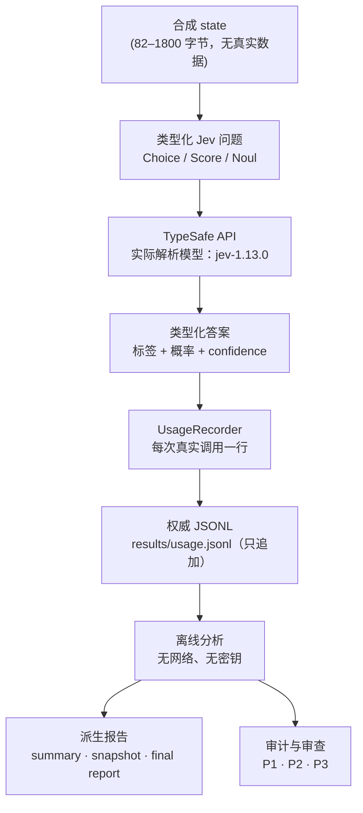
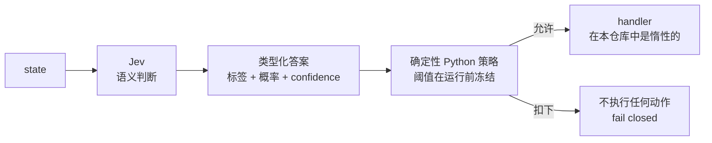
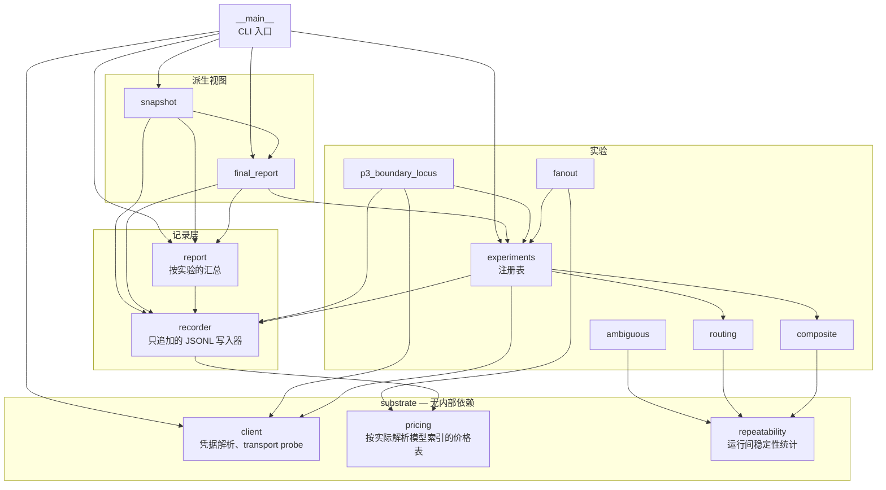

# 架构

[English](architecture.md) | **简体中文**

本仓库是一个 **CLI 加一个证据库**，不是库，也不是服务。这决定了下面的一切：受支持的接口就是命令行
加上它写出的文件，而 Python 包的存在是为了服务这两者。

---

## 1. 数据流



真正承重的是从 **API** 到 **JSONL** 的那条边：一次真实 API 调用恰好产生一条记录，无论调用成功还是
抛异常，都由 `UsageRecorder` 写入。没有任何路径绕过 recorder，事后也没有任何东西重写日志 —— 它是只
追加的，因此这个文件就是「实际发送了什么、实际返回了什么」的时间顺序记录。

日志下游的一切都是**派生的**。`report`、`snapshot` 和 `final-report` 在输出时从日志重新计算每一个
数字，因此它们不可能与它们所描述的记录发生漂移。一个与日志不符的派生文件是过期副本，而不是第二份测量。

### 一次派生，浓缩成一行

```
本地估算    =  输入 token × 公布费率        （按实际解析模型，出自唯一价格表）
权威记录    =  TypeSafe Console 账单        （服务器端，不是本仓库）
```

成本是本地派生并处处如此标注的。Token 计数从不估算 —— 它们是 API 返回的 `usage` 值。

---

## 2. Agent 控制模式

本实验台要考察的工程模式。这就是 TypeSafe 文档所描述的形状，在本仓库中实现时把边界明确画了出来：



有两个性质很重要，而且它们都是被测试强制保证的，而不是靠意图：

**模型从不执行任何东西。** 一个 Jev 答案只能选中一个在运行前就已冻结在注册表里的**名字**。它绝不会
被 `eval`、`exec`、import，也不会被当作点分路径。注册表之外的标签、缺失的参数、或落在所选函数冻结
集合之外的参数，全部 fail closed —— 什么都不会被调用，该 case 记录 `FUNCTION_ROUTE_UNAVAILABLE`。

**语义路由不等于执行授权。** 模型选择的是哪些代码**有资格**行动；是否真的行动，是之后在 Python 中
决定的。这不是形式主义。在 `12_function_routing` 中，模型 4 / 4 次匹配到预期函数、4 / 4 次匹配到
预期参数 —— 而冻结策略**扣下了全部**路由，因此没有任何 handler 被执行。任何把「有信心的路由」当作
行动许可的系统，都已经删掉了产生这个结果的那一层。

---

## 3. 模块地图

包是 `src/jev_lab/` —— 刻意保持**扁平**。在这个规模上，import 图是一个无环的干净 DAG，层次从 import
语句就能看出来，不需要再建一棵目录树去导航。拆出 `core/` · `utils/` · `services/` 只会增加目录，不会
增加抽象。



| 模块 | 职责 |
|---|---|
| `client` | 按唯一固定顺序解析凭据、构造客户端、`TransportProbe`、`scrub_secrets`。 |
| `pricing` | 本仓库中唯一的价格表，按**实际解析**的模型索引。 |
| `recorder` | `UsageRecorder` —— 每次真实 API 调用一行只追加的 JSONL。 |
| `report` | 按实验的汇总（`summary.csv`、`summary.md`）。 |
| `experiments` | 十五个实验的注册表；case、档位、预算、`run_experiment`。 |
| `composite`、`routing`、`fanout`、`ambiguous` | 四个特定行为的实验，各自带有自己的章节构造器。 |
| `p3_boundary_locus` | P3 重复实验。**不**在 `EXPERIMENTS` 中 —— 加进第十六个成员会改变已冻结的最终报告的含义。 |
| `repeatability` | 重复 payload 实验的运行间统计。 |
| `final_report`、`snapshot` | 基于权威日志的派生视图。 |
| `__main__` | 参数解析与六个子命令。 |

### 层次被刻意跨越的地方

有三个很小的数字格式化辅助函数被跨层共享：`format_number` 与 `format_ms` 位于 `repeatability`，
`plain_decimal` 位于 `report`。这两个模块都是*派生视图*模块，但这些辅助函数也被实验模块 import。

这是一个真实但很小的接缝。它被有意保留：修法会是新建一个小型格式化模块，而一个唯一职责就是托管三个
单行函数的模块，恰恰是本仓库要避免的那类「为填目录而造」的抽象。这些辅助函数是纯函数、全域定义、无
副作用，因此这点耦合不带来任何风险。

---

## 4. 公开 API 与内部 API

不存在受支持的 Python API。`src/jev_lab/__init__.py` 只导出 `__version__`，这是刻意的。

```
受支持的接口  =  CLI  +  它写出的证据文件
内部          =  src/jev_lab/ 下除 __main__ 之外的一切
```

假装不是这样，只会制造一个本项目无意维护的兼容性表面。如果你想把这个实验台当库用，请 import 你需要的
模块并固定 commit —— 但要知道模块布局是可以变的。

---

## 5. 安全性质，以及是什么在保证它们

| 性质 | 由什么保证 |
|---|---|
| API 花费有界 | 每个实验都声明固定的 case 列表；`run` 默认上限 8 次调用；`run-all` 在显式预算未覆盖该档时拒绝启动。 |
| 无无界循环 | 两个重复实验各上限 5 次；任何会调用 API 的循环都受 case 列表与 `--max-requests` 约束。 |
| 凭据 fail closed | 来源缺失、为空、格式错误、重复或不可读，都会在**发出请求之前**终止运行。 |
| 任何输出中都没有密钥 | `api_key_status()` 只报告状态；不存在任何为展示而返回密钥的代码路径；`scrub_secrets` 覆盖引用了响应的错误文本。 |
| 测试从不触网 | 测试套件直接封锁 socket，因此一次意外的 API 调用会失败，而不是花钱。 |
| 密钥不会被误提交 | `.gitignore` —— 而 `git check-ignore` 才是证明它的检查，不是文档里的一句注释。 |

以上没有一条是关于操作系统级安全的断言。真实的边界及其真实的局限，见 [SECURITY.md](../../SECURITY.md)。
